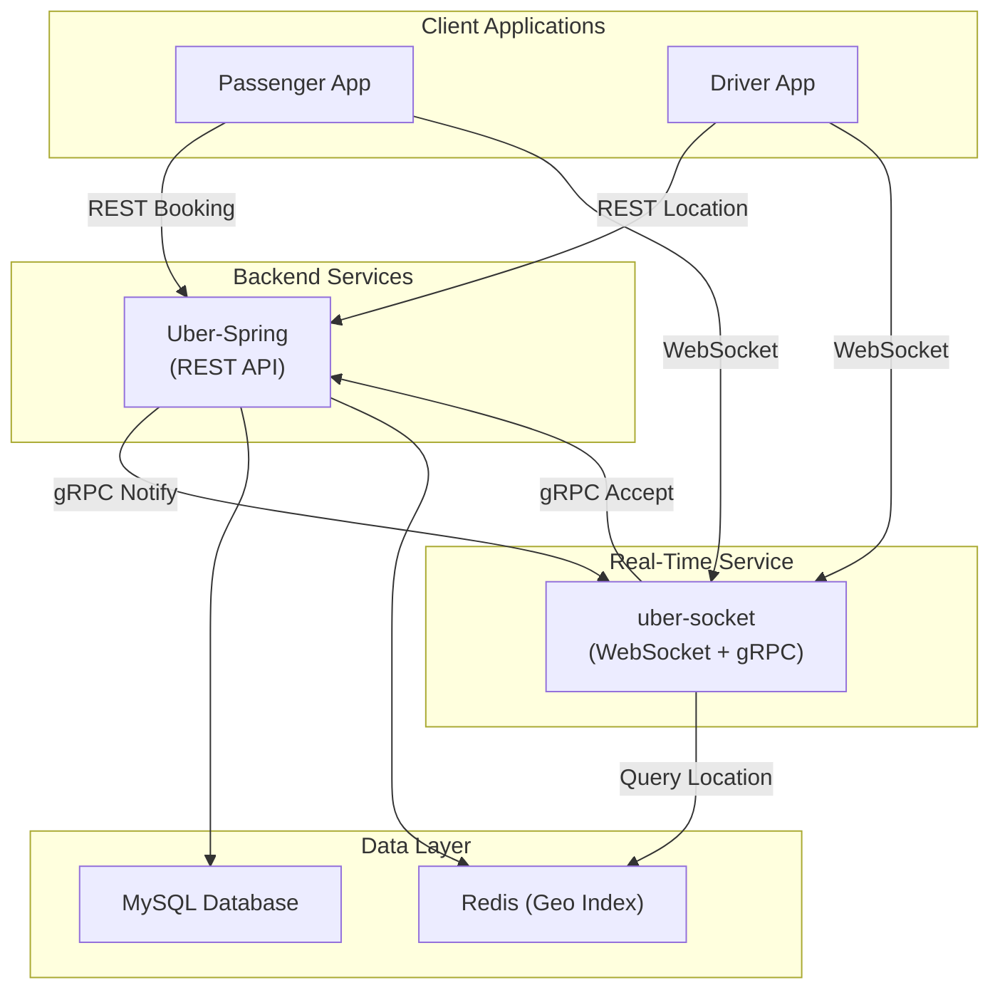
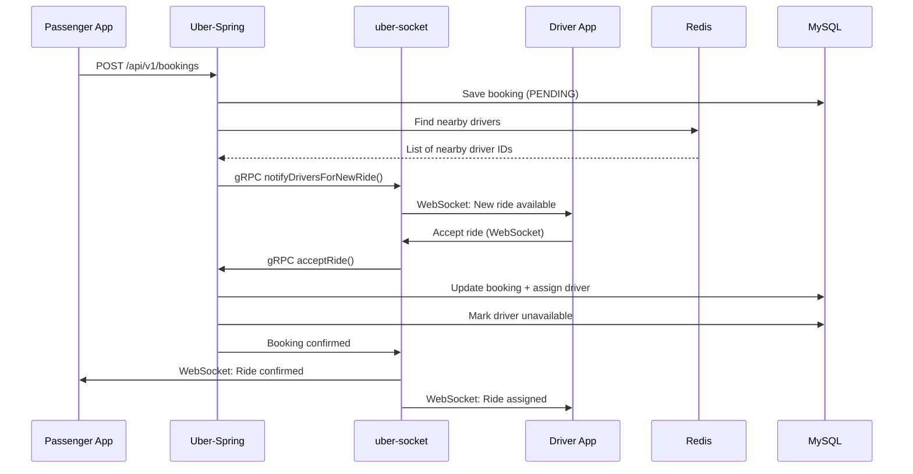
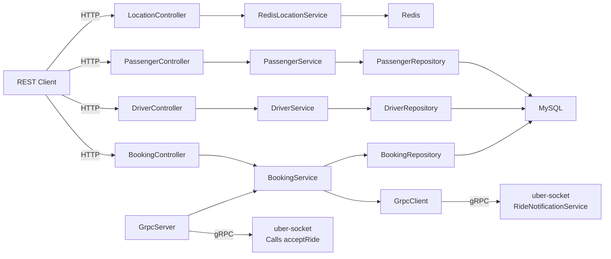

# Uber Ride-Hailing Platform

## Overview

This is a complete ride-hailing platform built with two integrated services:

1. **Uber-Spring** (this repository) - Backend API for passenger, driver, and booking management
2. **uber-socket** ([GitHub](https://github.com/krishnaagarwal2001/uber-socket)) - Real-time notification service for driver websocket connections

Together, they form a complete system that handles ride booking, driver matching, real-time notifications, and ride lifecycle management through both REST APIs and gRPC communication.

### Technology Stack

**Uber-Spring:**
- Spring Boot
- Spring Data JPA with MySQL
- Redis Geo queries for driver location lookup
- gRPC Client & Server
- REST APIs

**uber-socket:**
- WebSocket for real-time driver notifications via Socket.io
- gRPC Server for accepting bookings
- gRPC Client for notifying backends

The two services communicate via gRPC for booking confirmations and ride matching, while clients connect to uber-socket via WebSocket for real-time updates.

## Quick Navigation

Start with [Project Structure](#project-structure) → [System Architecture](#system-architecture) for understanding the system design. Then jump to [Running the Complete System](#running-the-complete-system) to get started, followed by [API Documentation](#api-documentation) and [WebSocket API Documentation](#websocket-api-documentation) for integration details.

- [Project Structure](#project-structure) — Understand the two-service architecture
- [Key Features & Capabilities](#key-features--capabilities) — Core features and technical capabilities
- [System Architecture](#system-architecture) — Visual diagrams and flows
- [Database Design](#database-design) — Data model and persistence
- [Design & Patterns](#design--patterns) — Architectural decisions and design patterns
- [Design Decisions & Rationale](#design-decisions-and-rationale) — Design decisions
- [gRPC Communication Contract](#grpc-communication-contract) — Inter-service contracts
- [API Documentation](#api-documentation) — Endpoint reference
- [WebSocket API Documentation](#websocket-api-documentation) — Real-time communication
- [Code Flow](#code-flow) — Trace through key flows
- [Environment & Configuration](#environment--configuration) — Configuration details
- [Service Startup Order](#service-startup-order) — Startup sequence
- [Running the Complete System](#running-the-complete-system) — Getting started (setup & startup)
- [Future Enhancements](#future-enhancements) — Planned improvements
- [System Design Notes](#system-design-notes) — Additional implementation notes

## Project Structure

This README documents the **complete Uber ride-hailing platform** consisting of two repositories:

### Repository 1: Uber-Spring (This Repo)
- **Location:** [github.com/krishnaagarwal2001/Uber-Spring](https://github.com/krishnaagarwal2001/Uber-Spring)
- **Role:** Backend REST API and transactional business logic
- **Language:** Java 21 + Spring Boot
- **Key Components:** Controllers, Services, Repositories, gRPC Server
- **Persistence:** MySQL + Redis
- **Ports:** 8080 (REST), 9090 (gRPC)

### Repository 2: uber-socket (External)
- **Location:** [github.com/krishnaagarwal2001/uber-socket](https://github.com/krishnaagarwal2001/uber-socket)
- **Role:** Real-time notifications and WebSocket connectivity
- **Language:** Node.js
- **Key Components:** WebSocket Server, gRPC Client, Event Broadcaster
- **Connectivity:** WebSocket to clients, gRPC to Uber-Spring
- **Ports:** 8082 (WebSocket), 9091 (gRPC)

## Key Features & Capabilities

### Uber-Spring Backend

**Functional Features:**
- Passenger CRUD operations with profile management
- Driver CRUD operations with availability tracking
- Booking lifecycle management (pending, confirmed, in-progress, completed, cancelled)
- Redis-based geospatial driver location search
- REST APIs for all entities and operations

**Technical Capabilities:**
- Full-stack Spring Boot REST API with layered architecture
- MySQL transactional data persistence with JPA
- Redis geospatial queries for real-time driver location search
- gRPC server for ride acceptance callbacks
- Rich validation and centralized error handling
- Auditing enabled via `@EnableJpaAuditing` for all entities

### uber-socket Real-Time Service

**Functional Features:**
- WebSocket connections for drivers to receive live ride notifications
- WebSocket connections for passengers to track ride progress
- Real-time event broadcasting to connected clients
- Ride confirmation handling and acknowledgment

**Technical Capabilities:**
- WebSocket server for driver and passenger connections
- gRPC client for booking notifications from Uber-Spring
- gRPC server for accepting ride confirmation events
- Real-time event broadcasting and notifications
- Session and connection lifecycle management
- Heartbeat and reconnection handling for stale connections

### System Integration

**Functional Features:**
- gRPC notifications from Uber-Spring to uber-socket when a booking is created
- gRPC callbacks from uber-socket to Uber-Spring when a driver accepts a ride
- WebSocket push to drivers and passengers for real-time updates
- Robust validation and error handling across both services

**Technical Capabilities:**
- Bidirectional gRPC communication between services
- Type-safe Protocol Buffers messaging contracts
- REST API → WebSocket → gRPC event bridging
- Separation of transactional (SQL) and real-time (WebSocket) concerns
- Scalable microservices architecture with independent deployments

## System Architecture

### High-Level System Design



### Sequence Flow - Ride Booking



### Uber-Spring Component Architecture



## Database Design

### Entities

#### `Passenger`
- `id`
- `name`
- `email` (unique)
- `phoneNumber`
- `createdAt`
- `updatedAt`

#### `Driver`
- `id`
- `name`
- `email` (unique)
- `phoneNumber`
- `licenseNumber` (unique)
- `vehicleModel`
- `vehiclePlateNumber`
- `isAvailable`
- `createdAt`
- `updatedAt`

#### `Booking`
- `id`
- `passenger_id` (FK)
- `driver_id` (nullable FK)
- `pickupLocationLatitude`
- `pickupLocationLongitude`
- `dropoffLocation`
- `status`
- `fare`
- `scheduledPickupTime`
- `actualPickupTime`
- `completedAt`
- `createdAt`
- `updatedAt`

### Relationships

- One `Passenger` can have many `Booking` records
- One `Driver` can have many `Booking` records, but a booking may only have one driver
- Redis is used to store live driver positions, not persistent ride history

### DB Notes

- `BaseEntity` provides audit fields for all JPA entities
- Hibernate auto-ddl is enabled (`spring.jpa.hibernate.ddl-auto=update`) for development convenience

## Design & Patterns

### High-Level Design (HLD)

- **Layered Architecture**: Separates controllers, services, repositories, adapters, and external clients.
- **Service-Oriented Integration**: Uses gRPC to integrate backend booking logic with the external `uber-socket` service.
- **Polyglot Persistence**: MySQL stores transactional data; Redis stores geo location data for efficient nearby-driver lookup.
- **Event-driven notification**: `GrpcClient` notifies the socket service when a booking is created.
- **Separation of Concerns**: Transactional data (bookings, users) in SQL; real-time/ephemeral data (locations) in Redis.

### Architectural Patterns (HLD)

- **gRPC Server/Client Pattern**: Maintains bi-directional integration through a client for outgoing notifications and a server for incoming ride acceptances.
- **Dependency Injection**: Each service and repository is injected by Spring via constructor injection.
- **Reliability & Consistency Patterns**:
  - **Transactional Consistency**: `@Transactional` annotations ensure ACID properties for booking state changes.
  - **Optimistic Conflict Avoidance**: Driver availability flag prevents double-booking; status transitions are validated before state change.
  - **Error Isolation**: Global exception handler catches all service exceptions and returns consistent error responses.
  - **Graceful Degradation**: If gRPC notification to `uber-socket` fails, booking is still created (async resilience).
- **Data & Persistence Patterns**:
  - **Polyglot Persistence Strategy**: 
    - **MySQL**: Persistent booking records, user profiles, transaction history (ACID compliance required)
    - **Redis Geo-Index**: Real-time driver locations only (ephemeral, no persistence needed)
    - **Rationale**: Driver locations change rapidly (every few seconds). Storing in Redis eliminates I/O overhead and provides O(1) radius lookups instead of O(n) database scans.
  - **Ephemeral Data Pattern**: Driver locations are NOT persisted to disk. When Redis restarts, locations are updated in real-time as drivers reconnect and report their coordinates.
  - **Cache-Aside Pattern**: Locations are queried from Redis during booking creation; stale locations are automatically aged out by key expiration (can be implemented via TTL).

### Low-Level Design (LLD)

#### Structural Patterns
- **Adapter Pattern**: Converts between internal entities and API DTOs, preventing direct entity exposure.
- **Repository Pattern**: Spring Data JPA repositories abstract all persistence details.
- **Strategy Pattern**: `LocationService` interface allows swapping location provider implementations. Current implementation: `RedisLocationService`.

#### Behavioral Patterns
- **Observer/Notification Pattern**: `GrpcClient` acts as observer, notified when bookings are created to trigger driver notifications.

<a id="design-decisions-and-rationale"></a>
## Design Decisions & Rationale

#### Why Redis for Location Data?

1. **Performance**: Geospatial queries in Redis (`GEORADIUS`) run in milliseconds vs. database index scans
2. **Scalability**: Point locations are ephemeral; no need for persistent storage overhead
3. **Memory Efficiency**: Redis stores only active driver locations, not historical records
4. **Simplicity**: Built-in geo commands eliminate complex spatial query logic
5. **Real-time Nature**: Drivers update locations frequently; Redis accepts incremental updates efficiently

#### Why gRPC Instead of REST for Service-to-Service?

1. **Protocol Efficiency**: Binary serialization (Protocol Buffers) vs. JSON reduces payload size
2. **Performance**: Multiplexed HTTP/2 streams vs. separate HTTP connections
3. **Strong Typing**: Proto contracts prevent version mismatch errors
4. **Bi-directional**: Server can push multiple responses or streams (future extension)

#### Why Adapters Between Entities and DTOs?

1. **API Stability**: Entity schema changes don't break external API contracts
2. **Security**: Prevents accidental exposure of sensitive internal fields
3. **Flexibility**: Different API versions can use different DTO structures
4. **Decoupling**: Services don't expose database model details

### Why these patterns were used

- Layered architecture improves maintainability and testability.
- Adapters avoid leaking persistence details into controller or external layers.
- The strategy pattern enables future extension to alternative geo providers without changing booking logic.
- gRPC enables low-latency, binary communication with the external socket service, which is ideal for ride-hailing event notifications.
- Polyglot persistence separates concerns: transactional guarantees for business logic, and high-throughput caching for ephemeral data.

## gRPC Communication Contract

The two services communicate through a well-defined gRPC interface. This enables type-safe, efficient, and language-agnostic communication.

### gRPC Services Defined

#### `RideNotificationService` (Exposed by uber-socket)

Called by **Uber-Spring** to notify uber-socket of a new booking.

```proto
message RideNotificationRequest {
  double pick_up_location_latitude = 1;
  double pick_up_location_longitude = 2;
  int64 booking_id = 3;
  repeated int64 driver_ids = 4;
}

message RideNotificationResponse {
  bool success = 1;
}

service RideNotificationService {
  rpc notifyDriversForNewRide(RideNotificationRequest) returns (RideNotificationResponse);
}
```

**When Called:**
- Immediately after a new booking is created in Uber-Spring
- With a list of nearby driver IDs from Redis geo-search

**uber-socket Behavior:**
- Receives the notification
- Looks up WebSocket connections for the specified driver IDs
- Broadcasts the ride details to connected drivers
- Returns success/failure status

#### `RideService` (Exposed by Uber-Spring)

Called by **uber-socket** when a driver accepts a ride via WebSocket.

```proto
message RideAcceptanceRequest {
  int64 driver_id = 1;
  int64 booking_id = 2;
}

message RideAcceptanceResponse {
  bool success = 1;
}

service RideService {
  rpc acceptRide(RideAcceptanceRequest) returns (RideAcceptanceResponse);
}
```

**When Called:**
- When a driver accepts a ride through the uber-socket WebSocket connection
- uber-socket bridges the WebSocket event into a gRPC call

**Uber-Spring Behavior:**
- Updates the booking to CONFIRMED status
- Assigns the driver to the booking
- Marks the driver as unavailable
- Returns success/failure status

### gRPC Configuration

**Uber-Spring:**
- Server runs on `grpc.server.port` (default `9090`)
- Client connects to uber-socket at `grpc.client.host:grpc.client.port` (default `localhost:9091`)

**uber-socket:**
- Server runs on configured port for `RideNotificationService`
- Client connects to Uber-Spring gRPC server for `RideService` calls

## API Documentation

### Uber-Spring Backend Service

#### REST Controllers

- `BookingController` - booking lifecycle endpoints
- `DriverController` - manage driver records and queries
- `PassengerController` - manage passenger records
- `LocationController` - save driver location and fetch nearby drivers

#### Services

- `BookingService` - core business logic for booking creation, update, status changes, driver assignment, and ride acceptance handling
- `DriverService` - driver business rules and availability management
- `PassengerService` - passenger persistence and validation
- `RedisLocationService` - location persistence and search using Redis geo-index
- `RideService` - gRPC server implementation to receive ride acceptance events

#### Data Access

- `BookingRepository` - JPA repository for booking persistence
- `DriverRepository` - JPA repository for driver persistence
- `PassengerRepository` - JPA repository for passenger persistence

#### Adapters

- `BookingAdapter` - transforms between Booking entity and BookingRequest/BookingResponse DTOs
- `DriverAdapter` - transforms between Driver entity and DriverRequest/DriverResponse DTOs
- `PassengerAdapter` - transforms between Passenger entity and PassengerRequest/PassengerResponse DTOs

### uber-socket Real-Time Service

**Repository:** [github.com/krishnaagarwal2001/uber-socket](https://github.com/krishnaagarwal2001/uber-socket)

#### Key Components

- **WebSocket Server** - Maintains persistent connections with drivers and passengers
- **gRPC Server (RideService)** - Receives ride acceptance callbacks from drivers via WebSocket
- **gRPC Client (RideNotificationService)** - Receives new booking notifications from Uber-Spring
- **Event Broadcaster** - Broadcasts real-time updates to connected clients
- **Connection Manager** - Manages driver/passenger session lifecycle

#### Responsibilities

- Accept WebSocket connections from drivers and passengers
- Broadcast new ride notifications to nearby drivers
- Forward driver acceptance decisions back to Uber-Spring via gRPC
- Push real-time ride status updates to clients
- Handle connection failures and reconnection logic

### Booking APIs

`GET /api/v1/bookings`
- Returns all bookings

`GET /api/v1/bookings/{id}`
- Returns booking by id

`GET /api/v1/bookings/passenger/{passengerId}`
- Returns bookings for a passenger

`GET /api/v1/bookings/driver/{driverId}`
- Returns bookings for a driver

`POST /api/v1/bookings`
- Create a new ride booking

Example request body:

```json
{
  "passengerId": 1,
  "driverId": null,
  "pickupLocationLatitude": 28.7041,
  "pickupLocationLongitude": 77.1025,
  "dropoffLocation": "Connaught Place, Delhi",
  "fare": 150.00,
  "scheduledPickupTime": "2025-12-01T10:00:00"
}
```

`PUT /api/v1/bookings/{id}`
- Update an existing booking

`PATCH /api/v1/bookings/{id}/status?status=COMPLETED`
- Update ride status

`DELETE /api/v1/bookings/{id}`
- Delete a booking

### Driver APIs

`GET /api/v1/drivers`
- Get all drivers

`GET /api/v1/drivers/{id}`
- Get a driver by id

`GET /api/v1/drivers/email/{email}`
- Get driver by email

`GET /api/v1/drivers/available`
- List all available drivers

`POST /api/v1/drivers`
- Create a driver

`PUT /api/v1/drivers/{id}`
- Update driver profile

`DELETE /api/v1/drivers/{id}`
- Delete a driver

### Passenger APIs

`GET /api/v1/passengers`
- Get all passengers

`GET /api/v1/passengers/{id}`
- Get passenger by id

`GET /api/v1/passengers/email/{email}`
- Get passenger by email

`POST /api/v1/passengers`
- Create a passenger

`PUT /api/v1/passengers/{id}`
- Update passenger profile

`DELETE /api/v1/passengers/{id}`
- Delete a passenger

### Location APIs

`POST /api/v1/location/driverLocation`
- Save driver location to Redis

Example request:

```json
{
  "driverId": 1,
  "latitude": 28.7041,
  "longitude": 77.1025
}
```

`POST /api/v1/location/nearbyDrivers`
- Find nearby drivers using Redis geo queries

Example request:

```json
{
  "latitude": 28.7041,
  "longitude": 77.1025,
  "radius": 10.0
}
```

## WebSocket API Documentation

### uber-socket Real-Time Communication

**Repository:** [github.com/krishnaagarwal2001/uber-socket](https://github.com/krishnaagarwal2001/uber-socket)

The uber-socket service provides WebSocket API endpoints for real-time communication between drivers, passengers, and the ride-hailing system using STOMP over WebSocket protocol.

#### Connection Details

- **Protocol:** STOMP over WebSocket
- **Endpoint:** `ws://localhost:8082/ws-uber`
- **Fallback:** SockJS enabled for browser compatibility
- **Authentication:** None (future enhancement)

#### Message Destinations

##### Server → Client Messages (Subscriptions)

**Ride Notifications to Drivers:**
- **Destination:** `/topic/new-ride/{driverId}`
- **Purpose:** Notify driver of new ride request
- **Payload:**
```json
{
  "pickupLocationLatitude": 28.7041,
  "pickupLocationLongitude": 77.1025,
  "bookingId": 123
}
```

##### Client → Server Messages (Send)

**Ride Acceptance from Driver:**
- **Destination:** `/app/ride-acceptance`
- **Purpose:** Driver accepts a ride request
- **Payload:**
```json
{
  "driverId": 789,
  "bookingId": 123
}
```

#### Client Integration Example

**JavaScript Client:**
```javascript
// Connect to WebSocket
var socket = new SockJS('/ws-uber');
var stompClient = Stomp.over(socket);

// Establish connection
stompClient.connect({}, function(frame) {
    console.log('Connected to uber-socket');

    // Subscribe to ride notifications
    stompClient.subscribe('/topic/new-ride/' + driverId, function(message) {
        var rideData = JSON.parse(message.body);
        console.log('New ride request:', rideData);

        // Handle ride notification (show to driver)
        showRideNotification(rideData);
    });
});

// Accept ride function
function acceptRide(driverId, bookingId) {
    stompClient.send('/app/ride-acceptance', {}, JSON.stringify({
        driverId: driverId,
        bookingId: bookingId
    }));
}

// Handle connection errors
stompClient.onStompError = function(frame) {
    console.error('WebSocket error:', frame);
};
```

#### Message Flow

1. **Driver Connection:** Driver app connects to `/ws-uber` and subscribes to `/topic/new-ride/{driverId}`
2. **Ride Request:** When passenger books ride, server sends notification to driver's subscribed topic
3. **Ride Acceptance:** Driver sends acceptance message to `/app/ride-acceptance`
4. **Confirmation:** Server processes acceptance and may send confirmation messages

#### Error Handling

- **Connection Failures:** Implement reconnection logic with exponential backoff
- **Message Errors:** Handle invalid payloads gracefully
- **Network Issues:** WebSocket will automatically attempt reconnection

## Code Flow


### Booking creation flow

1. `BookingController.createBooking()` receives booking data.
2. `BookingService.create()` validates passenger, optionally assigns a driver, and persists a booking record.
3. If driver assignment is pending, `BookingService` queries `RedisLocationService.getNearbyDrivers()`.
4. The service maps nearby `DriverLocationDTO`s into driver IDs and uses `GrpcClient.notifyDriversForNewRide()`.
5. The external socket service receives driver notifications and attempts to match or notify drivers.

### Ride acceptance flow

1. External socket service calls this app's gRPC `RideService.acceptRide()`.
2. `RideService` delegates to `BookingService.acceptRide()`.
3. Booking status is updated, the driver is assigned and marked unavailable, and the booking is saved.

### Location update flow

1. `LocationController.saveDriverLocation()` persists driver geolocation into Redis.
2. `LocationController.getNearbyDrivers()` performs a geospatial radius search.

## Environment & Configuration

Both services use environment variables for all external connections and sensitive information.

### Uber-Spring Environment Variables

- `DATA_SOURCE_URL` - MySQL JDBC connection string (required)
- `DATA_SOURCE_USER_NAME` - MySQL username (required)
- `DATA_SOURCE_USER_PASSWORD` - MySQL password (optional)
- `REDIS_HOST` - Redis hostname (default: `localhost`)
- `REDIS_PORT` - Redis port (default: `6379`)
- `REDIS_GEO_OPS_KEY` - Redis geo key used for driver locations (default: `driver:geo`)
- `GRPC_SERVER_PORT` - Port for gRPC server (default: `9090`)
- `GRPC_CLIENT_HOST` - Host of `uber-socket` gRPC service (default: `localhost`)
- `GRPC_CLIENT_PORT` - Port of `uber-socket` gRPC service (default: `9091`)
- `SERVER_PORT` - HTTP REST server port (default: `8080`)

### uber-socket Environment Variables

- `SERVER_PORT` - WebSocket server port (default: `8082`)
- `GRPC_SERVER_PORT` - Port for gRPC server (default: `9091`)
- `GRPC_SERVER_HOST` - Hostname for gRPC server (default: `localhost`)
- `GRPC_CLIENT_HOST` - Host of Uber-Spring gRPC service (default: `localhost`)
- `GRPC_CLIENT_PORT` - Port of Uber-Spring gRPC service (default: `9090`)

### Sample `.env` Files

#### Uber-Spring `.env`

```env
# MySQL Configuration
DATA_SOURCE_URL=jdbc:mysql://localhost:3306/uber
DATA_SOURCE_USER_NAME=root
DATA_SOURCE_USER_PASSWORD=

# Server Configuration
SERVER_PORT=8080

# Redis Configuration
REDIS_HOST=localhost
REDIS_PORT=6379
REDIS_GEO_OPS_KEY=driver:geo

# gRPC Server (this service)
GRPC_SERVER_PORT=9090

# gRPC Client (uber-socket connection)
GRPC_CLIENT_HOST=localhost
GRPC_CLIENT_PORT=9091
```

#### uber-socket `.env`

```env
# Server Configuration
SERVER_PORT=8082

# gRPC Server (this service)
GRPC_SERVER_PORT=9091
GRPC_SERVER_HOST=localhost

# gRPC Client (Uber-Spring connection)
GRPC_CLIENT_HOST=localhost
GRPC_CLIENT_PORT=9090
```

## Service Startup Order

For proper operation, start services in this order:

1. **MySQL** and **Redis** (infrastructure)
2. **Uber-Spring** (backend API and gRPC server)
3. **uber-socket** (real-time service and gRPC client)

## Running the Complete System

### Prerequisites

- Java 21+
- Node.js 16+ (for uber-socket)
- MySQL 8.0+
- Redis 6.0+

### Setup Steps

#### 1. Clone both repositories

```bash
git clone https://github.com/krishnaagarwal2001/Uber-Spring.git
git clone https://github.com/krishnaagarwal2001/uber-socket.git
```

#### 2. Set up MySQL Database

```bash
mysql -u root -p
CREATE DATABASE uber_db;
```

#### 3. Set up Redis

```bash
# Using Docker
docker run -d -p 6379:6379 redis:latest

# Or if Redis is installed locally
redis-server
```

#### 4. Configure Uber-Spring

Create `.env` file in `Uber-Spring` directory using the configuration from the **Sample `.env` Files** section above.

#### 5. Start Uber-Spring

```bash
cd Uber-Spring
./gradlew clean bootRun
```

Expected output:
```
gRPC Server started on port 9090
```

#### 6. Configure and start uber-socket

Create `.env` file in `uber-socket` directory using the configuration from the **Sample `.env` Files** section above.

Then start the service:

```bash
cd uber-socket
npm install
npm start
```

Expected output:
```
Server running on port 8082
gRPC services ready on port 9091
```

### Verification

1. **Health Check - Uber-Spring REST API:**
   ```bash
   curl http://localhost:8080/api/v1/drivers
   ```

2. **Health Check - uber-socket WebSocket:**
   ```bash
   # Use WebSocket client or test drivers connecting to ws://localhost:8082
   ```

### Uber-Spring Build Commands

- `./gradlew clean build` - clean and build the project
- `./gradlew bootRun` - start Spring Boot application
- `./gradlew test` - run tests (disabled in build config by default)

## Future Enhancements

For proper operation, start services in this order:

1. **MySQL** and **Redis** (infrastructure)
2. **Uber-Spring** (backend API and gRPC server)
3. **uber-socket** (real-time service and gRPC client)

## Future Enhancements

### Uber-Spring Enhancements
- Add authenticated user roles for passengers, drivers, and admins via JWT
- Add dynamic pricing and fare estimation microservice
- Build a dedicated ML-based matchmaking service for optimal driver selection
- Add caching layer (Redis) for passenger/driver lookups to reduce DB load
- Add Swagger/OpenAPI documentation for REST endpoints
- Add distributed tracing and centralized logging (ELK stack / datadog)
- Add unit and integration tests for all layers with 80%+ coverage

### uber-socket Enhancements
- Implement gRPC streaming for live driver location updates
- Add heartbeat/keep-alive mechanism for stale WebSocket connections
- Implement reconnection backoff strategies
- Add connection pooling for gRPC clients

### System-Wide Enhancements
- Add event sourcing with Kafka for immutable ride lifecycle events
- Implement CQRS (Command Query Responsibility Segregation) pattern
- Add distributed transaction support with Saga pattern for booking-driver-payment flows
- Add rate limiting and circuit breakers for inter-service communication
- Implement comprehensive monitoring, metrics, and alerting
- Add automated deployment with Docker and Kubernetes
- Add end-to-end integration tests across both services

## System Design Notes

### Uber-Spring Notes
- The project uses Spring Data JPA entities with auditing enabled via `@EnableJpaAuditing`.
- `GrpcServerConfig` starts a dedicated internal gRPC server on application startup.
- `GrpcClient` sends ride notifications to the external `uber-socket` service.
- `RedisLocationService` stores driver locations with Redis geospatial operators for efficient radius search.

### Inter-Service Communication
- Uber-Spring exposes gRPC `RideService` for ride acceptance callbacks
- uber-socket exposes gRPC `RideNotificationService` to receive new booking notifications
- Both services use blocking stubs for synchronous request-response patterns
- Consider implementing async/streaming RPCs for high-throughput scenarios

### Related Repositories
- **uber-socket**: [github.com/krishnaagarwal2001/uber-socket](https://github.com/krishnaagarwal2001/uber-socket) - Real-time WebSocket and gRPC server

---

For questions or contributions, review the source packages under `src/main/java/com/example/Uber`, especially `controllers`, `services`, `repositories`, and `client`.
